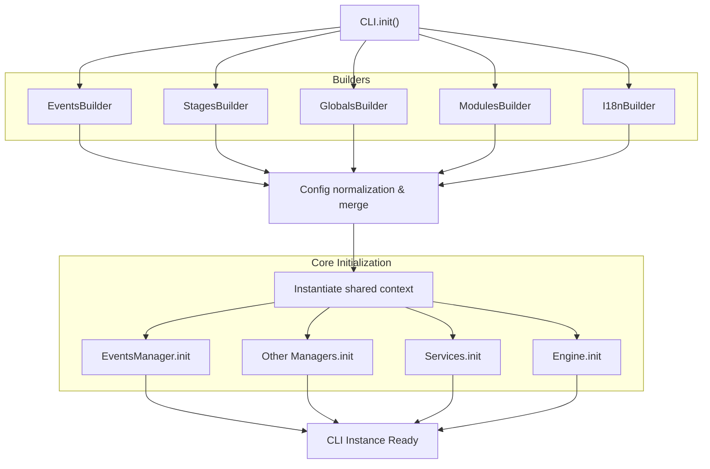
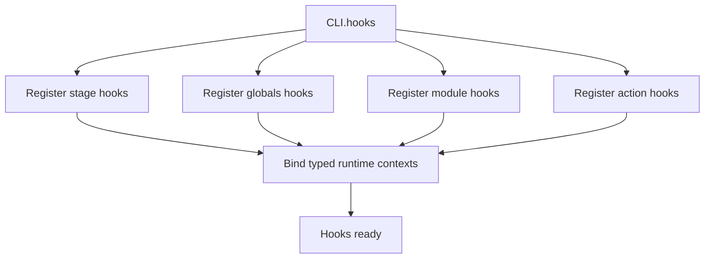
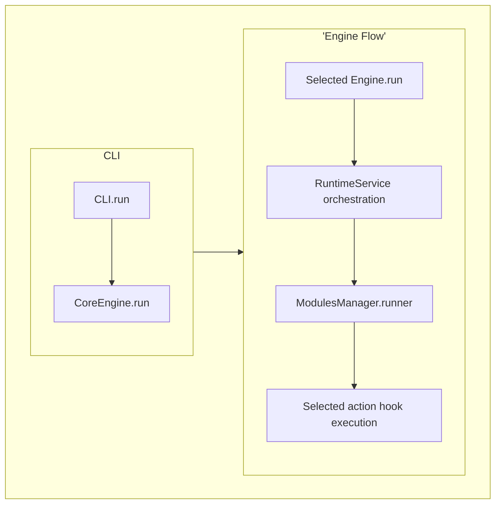
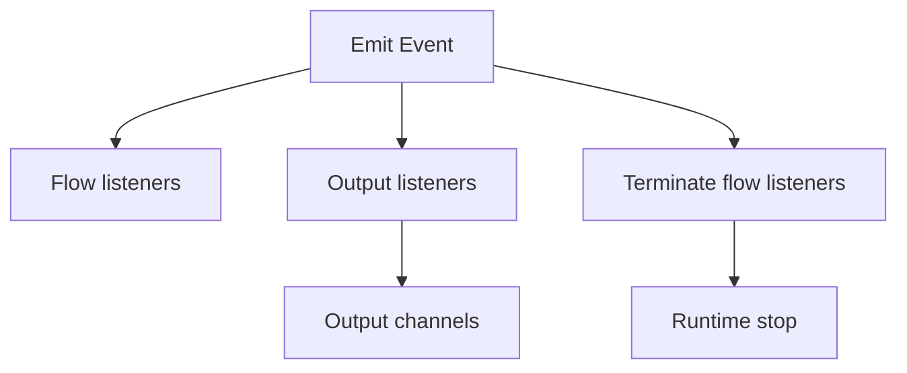
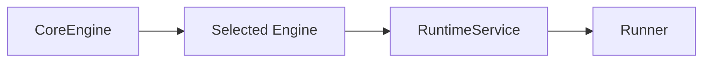
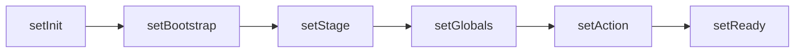

# Core Lifecycle

## Base Cycle

```mermaid
flowchart LR

%% UX/DX
A["cliCreator()"]

%% Config Building & init
B["CLI.init()"]

%% Hooking part
C["CLI.hooks()"]

%% Runtime Part
D["CLI.run()"]

A --> B
B --> C
C --> D

````

The core lifecycle always follows the same sequence:

* cliCreator(): developer-side configuration building (UX/DX)
* CLI.init(): full initialization of the core and its internal components
* CLI.hooks(): runtime hooks registration
* CLI.run(): runtime execution and selected action execution

This structure clearly separates:

* definition (UX/DX)
* construction (init)
* wiring (hooks)
* execution (runtime)

---

## Event Types Availability

Different types of events are not available at all stages of the core lifecycle.

* `CoreError`:

  * available before and throughout the entire initialization phase (`cliCreator` & `CLI.init`)

* `Signal`:

  * available as soon as `EventsManager` is initialized

* `Message`:

  * available only during the `runtime`,
  * after stage resolution and `i18n` initialization

*These rules are fundamental to understanding core behavior, especially when writing hooks and handling errors.*

---

## CLI Creation Cycle (UX/DX) - cliCreator

```mermaid
flowchart LR

A[cliCreator]
B[dev settings]
C[build init dict]
D["CLI.init()"]

A --> B
B --> C
C --> D
```

The `cliCreator` corresponds to the developer-side definition phase.

It allows to:

* define UX/DX parameters (modules, actions, flags, stages, etc.)
* build an initialization dictionary (init dict)
* prepare data consumed by `CLI.init()`

This phase contains no runtime logic: it only produces a structured and typed configuration.

---

## Initialization Cycle



The core initialization cycle is split into two steps:

### 1. Configuration Construction

Builders are used to:

* generate required internal structures (events, stages, globals, modules, i18n)
* merge built-ins and custom declarations
* normalize and validate the final configuration

### 2. Core Initialization

Once the configuration is ready:

* a shared context is instantiated
* all internal components are initialized:

  * managers
  * services
  * engine

At the end of this phase, the CLI instance is ready to be used.

---

## Hooks Cycle



### Hook Types

| Hook        | Runtime Phase | Main Role                  |
| ----------- | ------------- | -------------------------- |
| StageHook   | stage         | Environment initialization |
| GlobalsHook | globals       | Global options resolution  |
| ModuleHook  | module        | Module flags handling      |
| ActionHook  | runtime       | Action execution           |

### Description

There are 4 types of hooks, each acting on a specific runtime phase:

* StageHook: First hook executed. It defines fundamental runtime elements before full validation:

  * language
  * environment variables (ENV)
  * execution context (e.g., sandbox)

* GlobalsHook:
  Executed during globals resolution.
  Allows interaction with global options and their associated flags.

* ModuleHook:
  Executed before the action.
  Handles flags specific to the selected module.

* ActionHook:
  Final execution hook.
  Once the runtime is frozen, it contains the action logic and code.

---

## Runtime Cycle



The runtime is the actual execution phase of the core.

It is responsible for:

* orchestrating the different runtime construction phases
* selecting and executing the appropriate engine
* triggering the runner associated with the selected action

The flow is:

1. `CLI.run` starts execution
2. `CoreEngine` selects the engine
3. the engine orchestrates the runtime via `RuntimeService`
4. `ModulesManager` provides the `runner`
5. the action hook is executed

During this phase:

* the core progressively transitions from `CoreError` to an event-driven system (signals only)
* messages are not yet available (no runtime, no i18n)

### Events System Base



The event system is transversal across the entire core.

It allows to:

* emit events (signal or message)
* listen to events via different types of listeners
* produce outputs (logs, console, etc.)
* control execution flow

Some events (error, fatal) can stop the runtime via terminate flow listeners.

### Engines vs RuntimeService



The responsibilities are clearly separated:

* `CoreEngine`: selects the engine to use
* `Engine`: orchestrates execution flow
* `RuntimeService`: guarantees runtime phases and integrity
* `Runner`: executes the final action

### RuntimeService Phases



The RuntimeService is responsible for runtime progression.

Each phase corresponds to a validated system state:

* `setInit`: runtime initialization
* `setBootstrap`: initial preparation
* `setStage`: stage and environment resolution
* `setGlobals`: global options resolution
* `setAction`: module and action selection
* `setReady`: runtime frozen, ready for execution

These phases guarantee:

* strict execution order
* runtime consistency
* a reliable foundation for hooks and events
