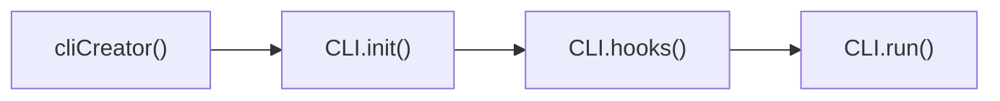
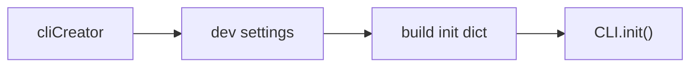
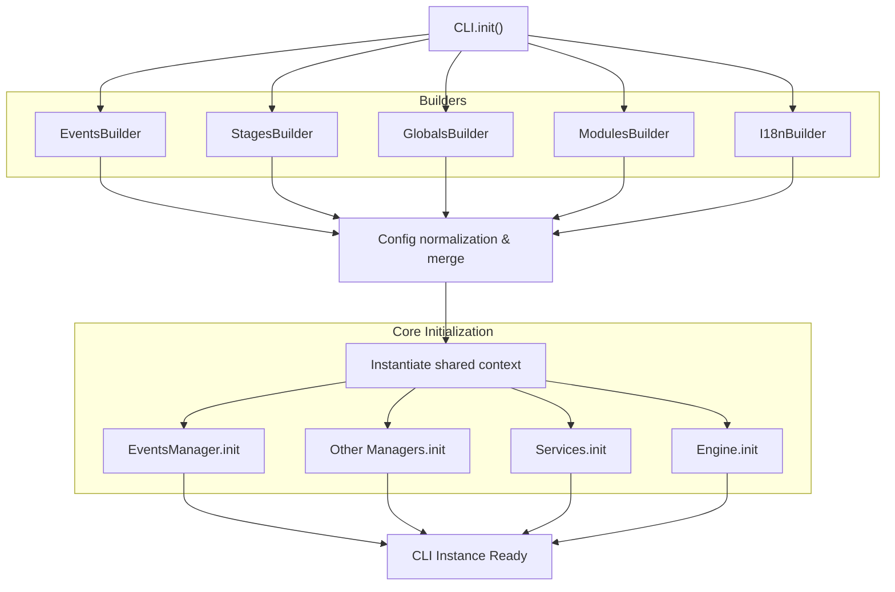
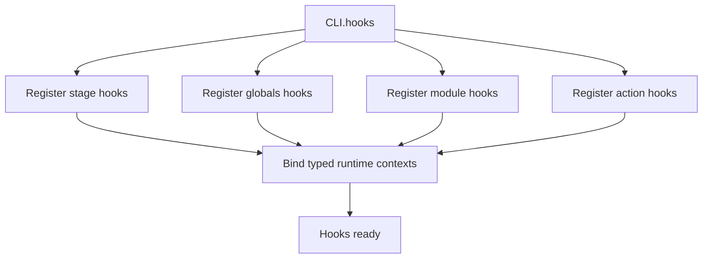
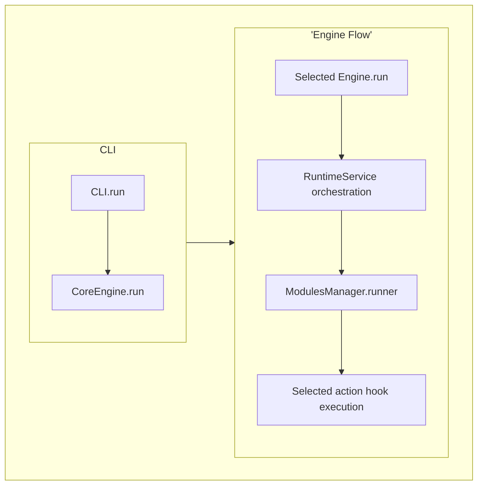
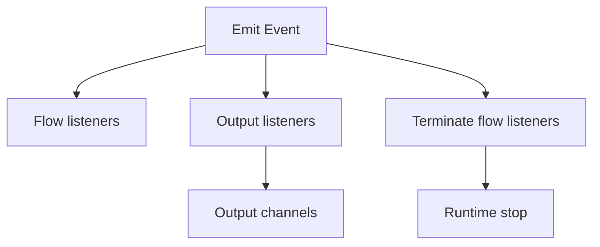
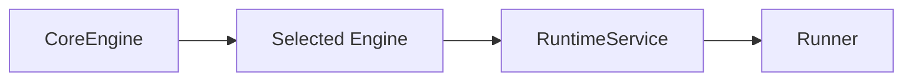
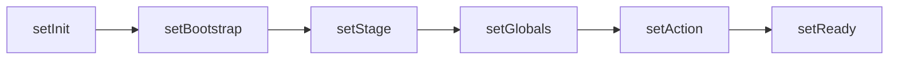

# Cycle de vie du Core

## Cycle de base

Le cycle de vie du core suit toujours la même séquence :

* cliCreator() : construction de la configuration côté développeur (UX/DX)
* CLI.init() : initialisation complète du core et de ses briques internes
* CLI.hooks() : enregistrement des hooks runtime
* CLI.run() : exécution du runtime et de l’action sélectionnée

Ce découpage permet de séparer clairement :

* la définition (UX/DX)
* la construction (init)
* le branchement (hooks)
* l’exécution (runtime)

---

## Disponibilité des types d'events

Les différents types d'events ne sont pas disponibles à tous les moments du cycle de vie du core.

* `CoreError` :
  * disponible avant et pendant toute la phase d'initialisation (`cliCreator` & `CLI.init`)

* `Signal` :
  * disponible dès que `EventsManager` est initialisé

* `Message` :
  * disponible uniquement pendant le `runtime`,
  * après la résolution du `stage` et l'initialisation de `i18n`

*Ces règles sont fondamentales pour comprendre le comportement du core, notamment dans l'écriture des hooks et la gestion des erreurs.*

---

## Cycle de création CLI (UX/DX) - cliCreator

Le `cliCreator` correspond à la phase de définition côté développeur.

Il permet de :

* définir les paramètres UX/DX (modules, actions, flags, stages, etc.)
* construire un dictionnaire d'initialisation (init dict)
* préparer les données qui seront consommées par CLI.init()

Cette phase ne contient aucune logique runtime : elle sert uniquement à produire une configuration structurée et typée.

---

## Cycle d'initialisation

Le cycle d'initialisation du core se décompose en deux étapes :

### 1. Construction de la configuration

Les builders permettent de :

* générer les structures internes nécessaires (events, stages, globals, modules, i18n)
* fusionner les builtins et les déclarations custom
* normaliser et valider la configuration finale

### 2. Initialisation du core

Une fois la configuration prête :

* un contexte partagé est instancié
* toutes les briques internes sont initialisées :
  * managers
  * services
  * engine

À la fin de cette phase, l’instance CLI est prête à être utilisée.

---

## Cycle des hooks

### Types de hook

| Hook         | Phase runtime | Rôle principal                    |
|--------------|--------------|----------------------------------|
| StageHook    | stage        | Initialisation environnement      |
| GlobalsHook  | globals      | Résolution options globales       |
| ModuleHook   | module       | Gestion flags module              |
| ActionHook   | runtime      | Exécution de l’action             |

### Description

Il existe 4 types de hooks, chacun agissant sur une phase spécifique du runtime :

* StageHook : Premier hook exécuté. Il permet de définir des éléments fondamentaux du runtime avant sa validation complète:
  * langue
  * variables d’environnement (ENV)
  * contexte d’exécution (ex : sandbox)

* GlobalsHook :
  Exécuté lors de la résolution des globals
  Permet d’agir sur les options globales et leurs flags associés.

* ModuleHook :
  Exécuté avant l'action.
  Permet de gérer les flags spécifiques au module sélectionné.

* ActionHook :
  Hook final d’exécution.
  Une fois le runtime figé, il contient la logique et le code de l'action.

---

## Cycle du runtime

Le runtime correspond à la phase d’exécution réelle du core.

Il est responsable de :

* orchestrer les différentes phases de construction du runtime
* sélectionner et exécuter le moteur approprié
* déclencher le runner associé à l’action sélectionnée

Le flux est le suivant :

1. `CLI.run` démarre l’exécution
2. `CoreEngine` sélectionne le moteur
3. le moteur orchestre le runtime via le `RuntimeService`
4. le `ModulesManager` fournit le `runner`
5. le hook d’action est exécuté

Pendant cette phase :

* le core passe progressivement de CoreError à un système event-driven (signal uniquement)
* les messages ne sont pas encore disponibles (pas de runtime, pas de i18n)

### Events system base

Le système d’events est transversal à tout le core.

Il permet de :

* émettre des événements (signal ou message)
* écouter les événements via différents types de listeners
* produire des sorties (logs, console, etc.)
* contrôler le flux d’exécution

Certains events (error, fatal) peuvent déclencher l’arrêt du runtime via les terminate flow listeners.

### Engines vs RuntimeService

Le rôle des différentes briques est clairement séparé :

* `CoreEngine` : sélectionne le moteur à utiliser
* `Engine` : orchestre le flux d’exécution
* `RuntimeService` : garantit les phases et l’intégrité du runtime
* `Runner` : exécute l’action finale

### RuntimeService Phases

Le RuntimeService est responsable de la progression du runtime.

Chaque phase correspond à un état validé du système :

* `setInit` : initialisation du runtime
* `setBootstrap` : préparation initiale
* `setStage` : résolution du stage et de l’environnement
* `setGlobals` : résolution des options globales
* `setAction` : sélection du module et de l’action
* `setReady` : runtime figé, prêt à exécuter

Ces phases garantissent :

* un ordre strict d’exécution
* une cohérence du runtime
* une base fiable pour les hooks et les events
